# 商城系统

## 总设计

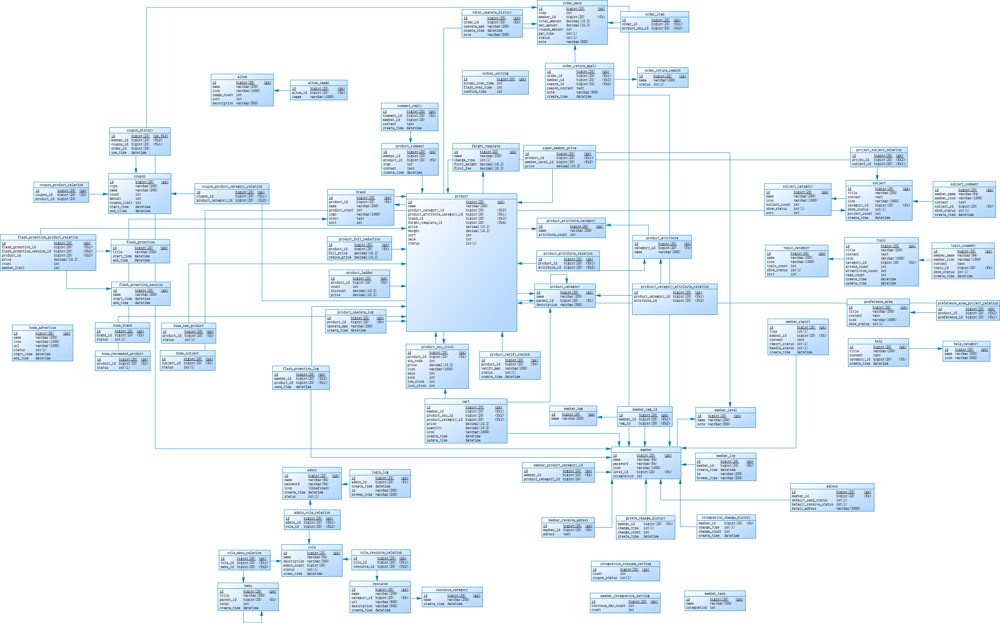

## 前缀

- pms：商品管理模块
- oms：订单管理模块
- sms：秒杀、营销管理模块
- cms：优选、话题模块
- ums：客户模块

## 优选商品-商品专题-话题-举报-帮助模块

**业务设计**

- 优选专区

  后台管理员手动挑选出商品展示在优选专区 or 根据每个商品的综合评估自动显示在优选专区

- 商品专题

  与以上一致

- 话题

  用户创建话题到话题区，其他用户评论，评论后该用户收到消息

  管理员对该话题有删除权限

**table design**

- subject `商品专题表`

- subject_category

  > sort：该分类的排序

- subject_comment 商品专题评论表

  > member_name：评论人

- project_subject_relation

  > 记录哪些商品在该商品专题下

- topic `话题表`

  > **该话题无关商品**，只是给用户讨论交流
  >
  > attend_count：话题参与人数
  >
  > attentition_count：话题关注人数

- topic_category

  > sort：该分类的排序

- topic_comment `话题评论表`

- preference_area `优选商品表`

- preference_area_product_relation

  > 记录哪些商品在优选专区

- help `帮助表`

- help_category

- member_report `用户举报表`

  > report_status：举报状态
  >
  > handle_status：处理状态

**UML**

 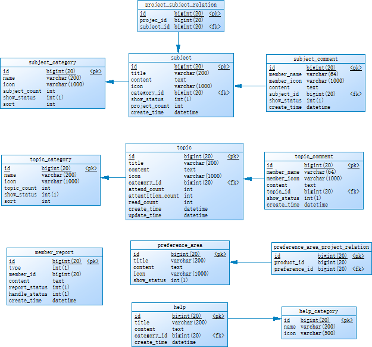

## 订单-购物车-地址模块

**table design**

- order

  > code：订单编号
  >
  > pay_amount：应付金额[əˈmaʊnt] 
  >
  > total_amount：总金额
  >
  > coupon_amount：优惠券金额[ˈkuːpɒn]
  >
  > note：备注

- order_item 

  > 记录订单对应的产品

- order_operate_history

  > 对订单的创建与修改的记录表
  >
  > operate_man：可以是用户、管理员

- order_return_apply

  > [əˈplaɪ] 申请
  >
  > reason_id：原因id

- order_return_season

- order_setting

  > flash_over_time：秒杀订单超时时间
  >
  > normal_over_time：订单超时时间
  >
  > confirm_over_time：发货后自动确实收获时间

- cart `购物车表[kɑːt]` 

  > quantity：数量[ˈkwɒntəti]

- adress

  > default_send_status：是否默认发货地址

  

**UML**

 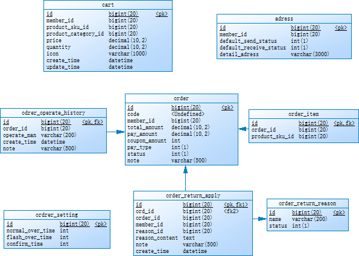

​		

## 产品模块

**table design**

- album

  > 相册表[ˈælbəm]

- alubm_image

  > 图片表
  >
  > album_id：该图片对应哪个相册

- brand

  > 品牌表[brænd]
  >
  > logo：品牌logo
  >
  > story：品牌的故事

- product_comment

  > 商品评价表
  >
  > star：评价星数

- comment_reply

  > 评论回复表

- super_member_price

  > 记录某些商品对于会员的价格
  >
  > member_level_id：哪些会员等级可以拥有该价格

- feight_template

  > charge_type：计费类型[tʃɑːdʒ] 
  >
  > first_weight：什么重量就需要支付以下的first_fee，有5个该重量即须支付5个first_fee
  >
  > first_fee：费用[fiː]

- product

  > sale：销量
  >
  > product_attribute_category_id：因为是product_attribute_category_id，**一个商品拥有多个product_attribute**

- product_category

- prodcuct_category_attribute_relation

  > 某个**商品分类**对应有哪些属性

- product_attribute_category

  > 商品属性分类表

- product_attribute

  > 商品属性表

- product_attribute_relation

  > 记录商品与属性的对应关系

- product_full_reduction

  > 商品满减表[rɪˈdʌkʃn]
  >
  > reduce_price：减少了多少金额

- product_ledder

  > [ˈlædə(r)] 商品数量达到多少后，每个商品级折扣多少
  >
  > discount：折扣百分比
  >
  > price：折扣后的价格

- product_operate_log

- product_verify_record

  > 商品审核记录表

- product_sku_stock

  > low_stock：预警库存
  >
  > lock_stock：锁定库存
  >
  > sale：销量

**UML**

 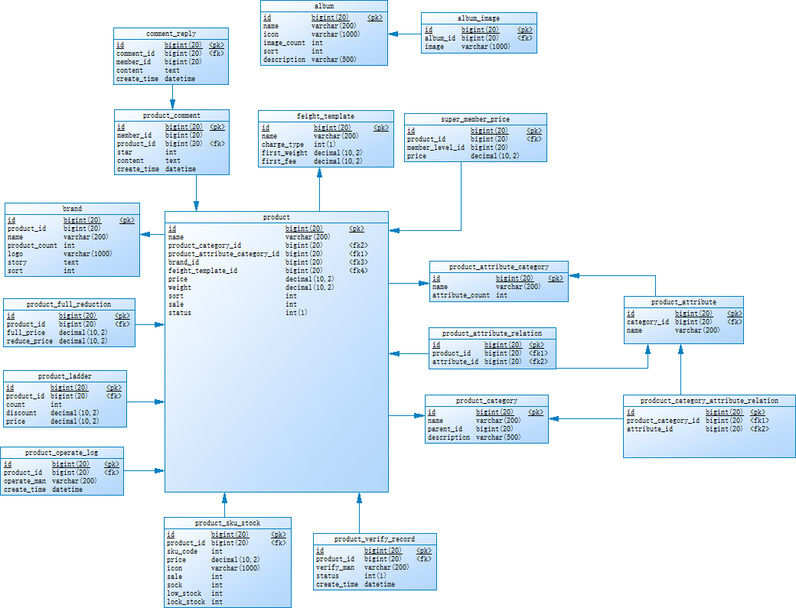

## 秒杀营销与首页模块

**table design**

- coupon

  > 优惠券表
  >
  > limit：每人限领数

- coupon_history

  > 优惠券使用记录

- coupon_product_category_relation

  > 每个商品分类都有优惠券

- coupon_product_relation

  > 哪个商品设置优惠券

- flash_promotion

  > [prəˈməʊʃn]秒杀促销表，即限时购表
  >
  > title：限时购主题

- flash_promotion_log

  > 推送限时购记录表
  >
  > product_id：哪个商品在限时购

- flash_promotion_product_relation

  > 记录哪些商品在限时购里

- flash_promotion_session

  > [ˈseʃ(ə)n]限时购场次表
  >
  > name：场次名称

- home_advertise

  > [ˈædvətaɪz]首页广告表
  >
  > status：上线或下线广告

- home_brand

  > 首页品牌推荐表

- home_new_product

  > 首页新鲜好物表

- home_recommend_product

  > [ˌrekəˈmend]首页推荐商品

- home_subject

**UML**

 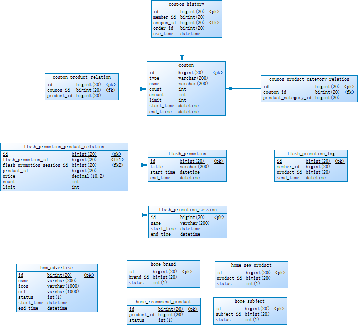

## 后台管理员与用户管理模块

**table design**

- growth_change_history

  > 成长值记录表
  >
  > type：增加或减少
  >
  > count

- integration_change_history

  > [ˌɪntɪˈɡreɪʃn]积分

- integration_consume_setting

  > [kənˈsjuːm]消费
  >
  > count：一元相当于多少积分
  >
  > coupon_status：是否可以和优惠券使用

- member_product_category_id

  > 用户喜欢哪个商品分类

- member_tag_id

  > 用户喜欢哪个标签

- member_receive_adress

- member_integration_setting

  > 用户连续登录赠送积分设置表
  >
  > continue_day_count：连续登录几天有赠送

- member_task

  > 用户任务表
  >
  > integration：赠送积分

**UML**

后台管理员模块

 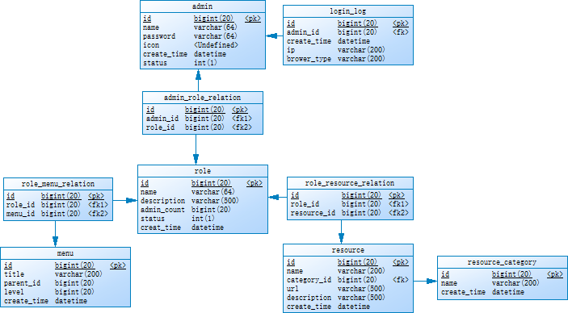

用户模块

 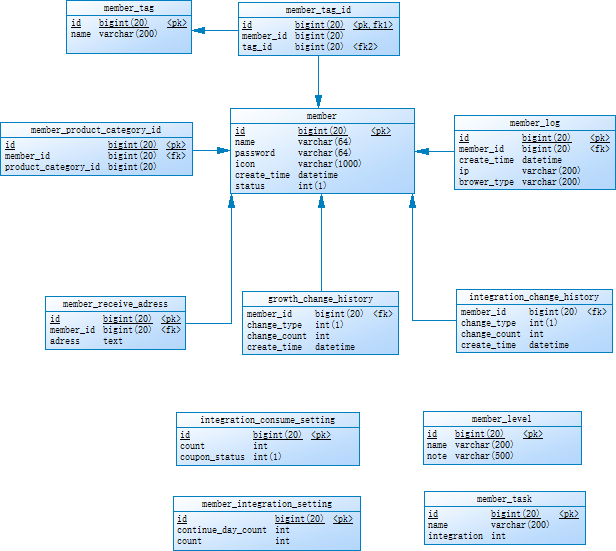

## **knowledge**

- 角色只有超级管理员、商品管理员、订单管理员

- 角色与菜单联系，角色与资源联系，**而不是**角色和菜单联系，菜单和资源联系

  

## **problems**

- permission不知道有什么用，角色列表的`分配菜单、分配资源对应menu、resource`，而菜列表的查看下级，是该菜单类型的子类的菜单

- 可能permission与resource是同级的

  mall代码没有关于permission的

- **reource**有什么用

  可能只是用于**显示**关于该Role，使用hasRole()修饰的url有多少，**不起实际作用**

  毕竟为该Role**添加url**，在代码层面上的**hasRole**不会消失

- **menu**有什么用

  为了前端对角色没有的菜单权限进行**隐藏**

- 为什么**没有支付相关表**

  支付使用**第三方支付**，成功则调用修改**订单状态**即可
  
- mall把优选、商品专题的CRUD都放在了首页的HomeRecommendProductController、HomeRecommendSubjectController

# 在线教育系统

## 课程-学习模块

**tables design**

- lesson

  > code：课程编号varchar(100)
  >
  > homework：作业内容
  >
  > homework_attachment：作业附件`[əˈtætʃmənt]` 
  >
  > **status：未发布、发布、下架**

- chapter

  > title：章节标题
  
- section `章的小节表[ˈsekʃn]`

- category` [ˈkætəɡəri]`

  > level：设置某个课程种类的等级
  >
  > sort_order：设置同一等级的课程种类的排序顺序

- category_relation `课程种类与课程种类联系表，建立课程种类的父子关系`

- lesson_category_relation

- sign_up `课程报名表`

- record `学习记录表`

- homework_record `作业记录表，每个学员提交作业后，就会自动创建该课程-学员的作业记录表`

  > url：前端应该有设置该课程的**统一**作业提交地址
  >
  > member_id：是哪个学员提交的
  >
  > **status：作业的状态：通过、不通过、等待通过** 	

  

**UML**

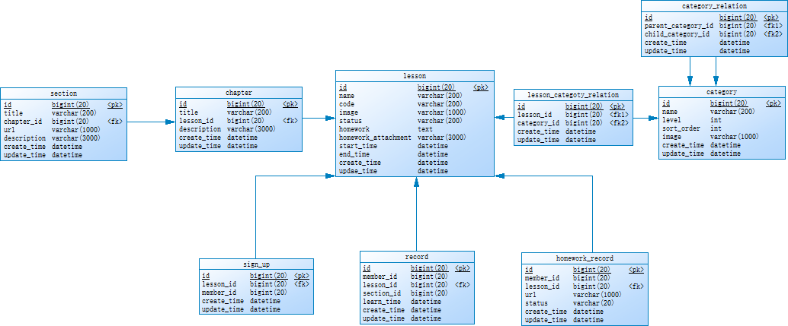

## 学员模块

**table design**

- member

  > code：学员编号
  >
  > **status varchar(200)：状态：normal、黑名单、注销、锁定**

- level `学员等级表` 

- member_level_relation

**UML**

 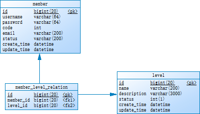

## 学员行为模块

**table design**

- comment

  > **topic_type：评论的主题类型，如课程还是文章**
  >
  > topic_id：以上指定了主题类型后，是该主题类型的哪个，如主题类型是课程，那是课程a还是课程b
  >
  > content：评论内容，设置为nvarchar(4000)最大值

- reply_comment `评论回复表[rɪˈplaɪ]`

- like `点赞表`

  > topic_type
  >
  > topic_id

- favorite `收藏表`

  > topic_type
  >
  > topic_id

- message `私信表`

  ​	

**UML**

 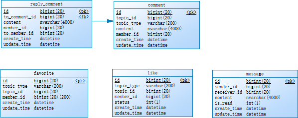

## 后台用户-权限-公司模块

> authority权限[ɔːˈθɒrəti] 

## 系统设置模块

**table design**

- slideshow `首页轮播图表 [slaid'ʃəu]`
- sensitive `敏感词表[ˈsensətɪv]`

**UML**

 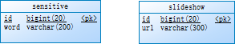

# 博客系统

**table design**

- article

  > is_comment_status：是否允许评论
  >
  > content：类型为**mediumtext**

**UML**

 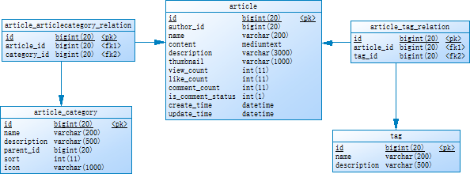

# RBAC

**table design**

- admin

- login_log`登录日志表`

- admin_role_relation

- role

  > admin_count：拥有该角色的用户人数

- role_menu_lelation

- menu

  > parent_id：父类菜单id
  >
  > level：菜单级数

- role_rescourse_relation

- resource

- resouce_categoy`资源种类表[ˈkætəɡəri]`

**UML**

 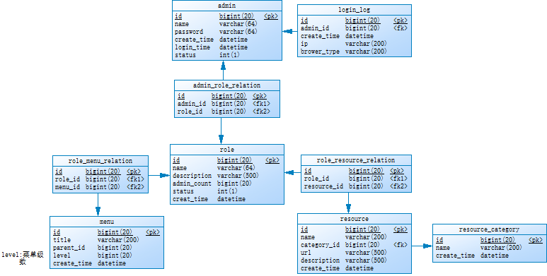

# 微信支付系统

**guess**

- 微信只需要确保**用户与用户**之间，可以使用微信中的个人财产进行**等值交换**
- 用户在微信进行**充值**，用户的财产额 + 充值数，微信所在银行账号财产额 + 用户充值数，用户返现到个人银行反之
- 微信支付系统设计最重要的是确保用户的**个人财产修改**万无一失

**knowledge**

- 微信内部有个**官方**财产额数据，与微信所在银行账号财产额数据**一致**

# ans

- **SQLyog查看外键**

  - Alter table可以看，文件 -> 新架构设计器拖拽后也可以看可视化图

## 商城系统

### 订单-产品模块

**table design**

- order_table
- order_setting`订单全局设置表`
- product
- sku_sock`商品sku库存表`

**UML**

 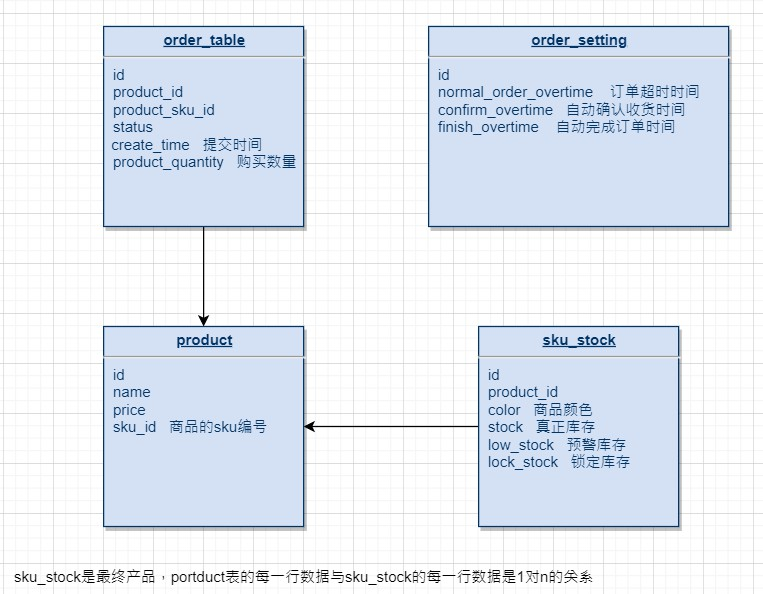
